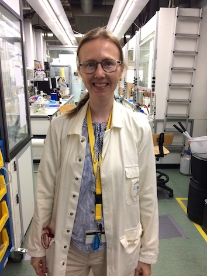

# Macrocyclic Receptors for Selective Anion Extraction (MAREXT)

    

## New Ph.D. student

<Calendar/> March 2019

Malgorzata Pamula (M.Sc., Chemistry) has started as a Ph.D. student in the project.

## Research at ICIQ

<Calendar/> May 2018 - April 2019

Enjoying the hospitality of Prof. Pau Ballester in his lab at the Institute of Chemical Research of Catalonia. The inspiring research atmosphere and instrumentation are just perfect for calix[4]pyrrole chemistry. 

## Overview

<Calendar/> May 2018 - April 2023

The project aims to offer pioneering solutions for the selective binding of biologically and technologically important anions. The target anions include anti-inflammatory drugs with carboxylate groups, and valuable resources, such as phosphate and precious metals (Au, Pt, Co). The project focuses on advanced synthesis of selective receptors, characterization of the anion complexes and development of extraction methods for target anions from water.

## Project Collaborators

  <Item
      src="../logo/iciq.png"
      alt="ICIQ"
      href="https://group.ballester.me"
      header="Prof. Pablo Ballester"
      text="ICREA research professor at the Institute of Chemical Research of Catalonia, ICIQ"
  />
  <Item
      src="../logo/gu.gif"
      alt="University of Gothenburg"
      href="http://cmb.gu.se/english/about_us/staff?languageId=100001&userId=xbjohq"
      header="Prof. Johan Bergenholtz"
      text="University of Gothenburg"
  />

## Funding

    

